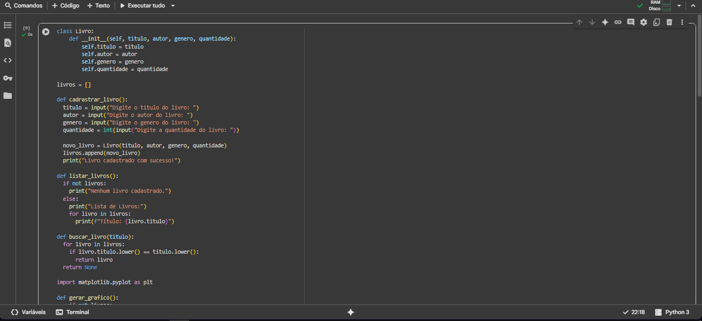
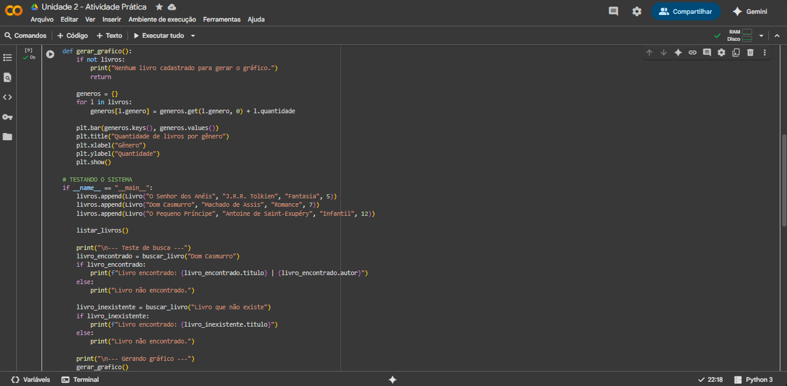
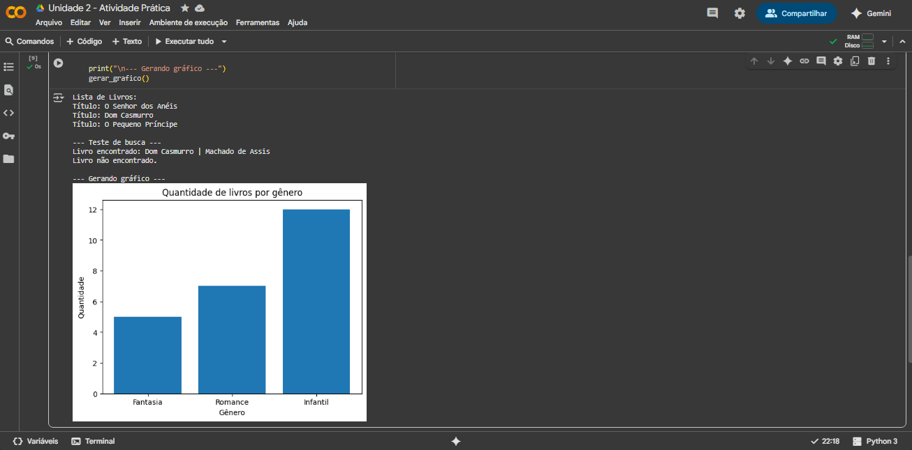

  #  ATIVIDADE PRÁTICA - Desenvolver um Sistema Simples de Gerenciamento de Livros Em Uma Biblioteca 

---

*A recomendação da minha instituição foi utilizar o Google Colab para desenvolver o código e executá-lo.*

---

## A ORIENTAÇÃO DO PROJETO FOI A SEGUINTE:

Você foi contratado para desenvolver um sistema simples de gerenciamento de livros em uma
biblioteca. O sistema deve permitir cadastrar novos livros, listar todos os livros disponíveis, buscar
um livro pelo título, e gerar um gráfico com a quantidade de livros por gênero.

### Passo 1: Definir a classe Livro
- Comece definindo a estrutura básica de um livro usando uma classe em Python. Cada livro
terá atributos como título, autor, gênero e quantidade disponível.

### Passo 2: Criar a lista de livros
- Inicialize uma lista vazia para armazenar os livros que serão cadastrados.

### Passo 3: Implementar funções para gerenciar os livros
- Função para cadastrar um novo livro
- Função para listar todos os livros
- Função para buscar um livro pelo título

Passo 4: Utilizar a biblioteca Matplotlib para gerar um gráfico
- Instalação da Matplotlib
- Gerar o gráfico de quantidade de livros por gênero

### Passo 5: Testar o sistema

---

## Vamos começar mostrando meu código por completo!

Você pode acompanhar pela imagem abaixo ou pelo arquivo aqui no github ---> [Arquivo do Projeto](https://github.com/lukkyzdev/SistemaSimplesDeGerenciamentoDeLivrosEmUmaBiblioteca/blob/main/SistemaSimplesDeGerenciamentoDeLivrosEmUmaBiblioteca.py)

## Execução do Código e Explicações

❗ **AVISO:** ❗ **Antes de mais nada, venho comunicar que solicitei sim auxílio de inteligências em partes que eu estava em dúvida (mas somente na dúvida), lembrando que esse é meu segundo código em Python e ainda não sou muito experiente.**

***Esse código implementa um sistema simples de gerenciamento de livros em Python, usando conceitos de programação orientada a objetos, listas e visualização de dados.***

- *Primeiro, é criada a classe **Livro**, que representa a estrutura de um livro, contendo atributos como título, autor, gênero e quantidade. Cada vez que um livro é cadastrado, um objeto dessa classe é instanciado e adicionado a uma lista chamada **livros**, que funciona como a estante da biblioteca.*

- *Para manipular essa lista, o sistema conta com funções específicas: a de cadastro **(cadrastrar_livro)** que solicita os dados ao usuário e cria um novo objeto, a de listagem **(listar_livros)** que percorre a lista exibindo todos os livros cadastrados, e a de busca **(buscar_livro)** que percorre a lista comparando o título informado com os existentes, retornando o livro se encontrado.*

- *Além disso, há a função **gerar_grafico**, que utiliza a biblioteca Matplotlib para contar quantos livros existem em cada gênero e exibir um gráfico de barras com essas informações, oferecendo uma visão clara da distribuição dos livros. No final, dentro do bloco **if __name__ == "__main__":**, o código insere alguns livros manualmente na lista e chama as funções de listagem, busca e geração de gráfico, funcionando como uma simulação prática de uso do sistema*

***O programa basicamente mostra, de forma prática, como criar e mexer com objetos, dados e gráficos, funcionando como um mini CRUD dentro de uma biblioteca.***

